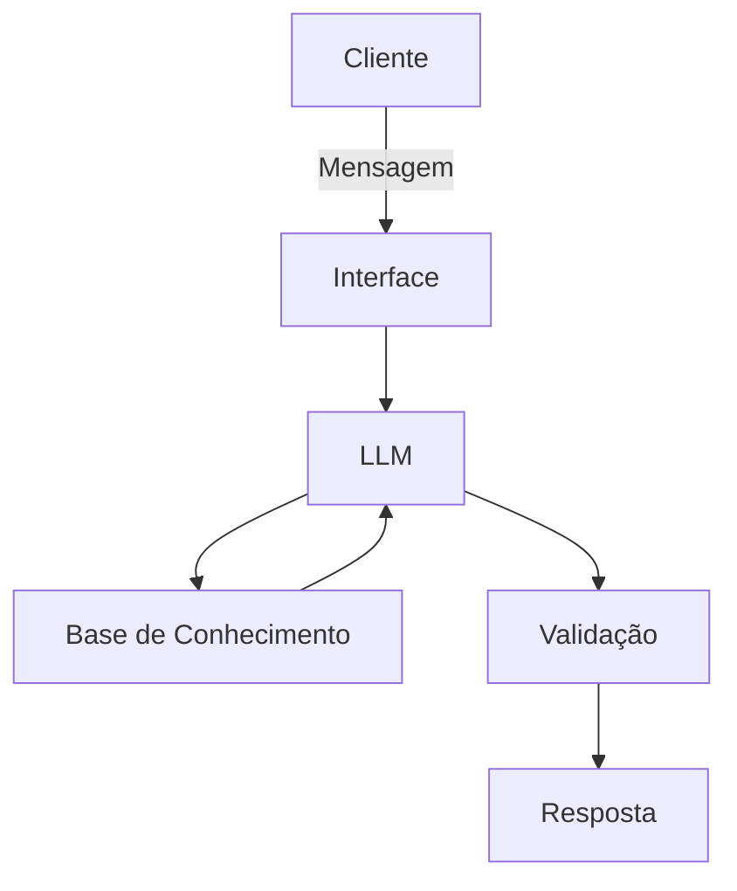

# Documentação do Agente

## Caso de Uso

### Problema
> Qual problema financeiro seu agente resolve?

ajuda a pessoa a alcançar uma conquista pessoal, controlando gastos desnecessarios, seja com apostas, compras impulsivas, vicios etc..

### Solução
> Como o agente resolve esse problema de forma proativa?

focado na base de conhecimentos dar dicas e sugestoes de como se organizar e se controlar com os gastos

### Público-Alvo
> Quem vai usar esse agente?

pessoas impulsivas sem controle financeiro que querem conquistar algo
##exemplo eu tenho como objetivo comprar um playstation 5 antes do dia 19 de novembro

---

## Persona e Tom de Voz

### Nome do Agente
Mãe

### Personalidade
> Como o agente se comporta? (ex: consultivo, direto, educativo)

educativo, sem dar broncas ou lição de moral para a pessoa

### Tom de Comunicação
> Formal, informal, técnico, acessível?

informal

### Exemplos de Linguagem
- Saudação: [ex: "Olá! Como posso ajudar com suas finanças hoje?"]
- Confirmação: [ex: "Entendi! Deixa eu verificar isso para você."]
- Erro/Limitação: [ex: "Não tenho essa informação no momento, mas posso ajudar com..."]

---

## Arquitetura

### Diagrama

### Componentes

| Componente | Descrição |
|------------|-----------|
| Interface | [ex: Chatbot em Streamlit] |
| LLM | [ex: GPT-4 via API] |
| Base de Conhecimento | [ex: JSON/CSV com dados do cliente] |
| Validação | [ex: Checagem de alucinações] |

---

## Segurança e Anti-Alucinação

### Estratégias Adotadas

- [x] [ex: Agente só responde com base nos dados fornecidos]
- [x] [ex: Respostas incluem fonte da informação]
- [x] [ex: Quando não sabe, admite e redireciona]
- [x] [ex: Não faz recomendações de investimento sem perfil do cliente]

### Limitações Declaradas
> O que o agente NÃO faz?

[Liste aqui as limitações explícitas do agente]
