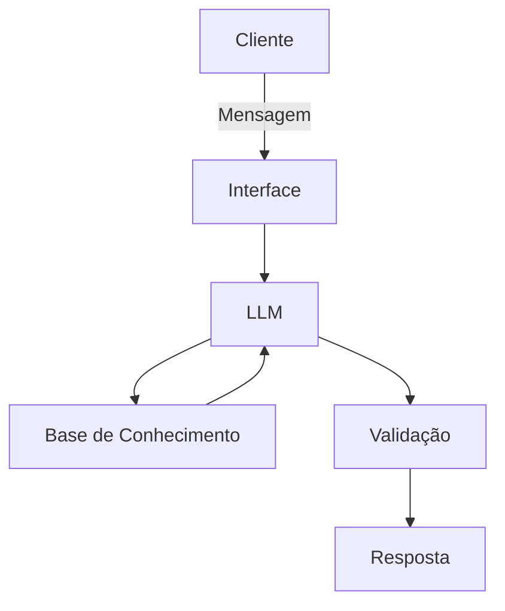

# Documentação do Agente

## Caso de Uso

### Problema
> Qual problema financeiro seu agente resolve?

O agente resolve o hiato entre o desejo e a posse. Automatiza a inteligência financeira necessária para alcançar objetivos de alto valor, entregando uma estratégia de alocação sob medida que ajusta o tempo ao seu bolso, eliminando a incerteza do investidor iniciante.

### Solução
> Ele resolve o problema proativamente através do monitoramento do mercado e da saúde financeira do usuário. Em vez de um relatório estático, o agente emite comandos de ajuste de rota: ele identifica quando um objetivo está em risco e sugere mudanças imediatas na alocação, além de detectar sobras de caixa para acelerar o alcance da meta, garantindo que o tempo final seja respeitado independentemente das oscilações externas."

### Público-Alvo
> O público-alvo é composto por jovens adultos e profissionais em ascensão que possuem uma meta de consumo de alto valor (imóveis, veículos, intercâmbios), mas enfrentam algum problema.

## Persona e Tom de Voz

### Nome do Agente
Atlas

### Personalidade
> Educativo e didático, vigilante, transparente e radicalmente honesto e educado
é direto em relação à viabilidade de algo

[Sua descrição aqui]

### Tom de Comunicação
> Formal- moderno, técnico mas traduz de forma acessível, comunicação marccada pela objetividade

[Sua descrição aqui]

### Exemplos de Linguagem
- Saudação: "Olá. Sou o Atlas, seu estrategista. O mercado abriu e já atualizei as projeções para sua meta [Nome da Meta]. Como posso otimizar seu plano hoje?"
- Confirmação: "Compreendido. Processei o novo aporte e reajustei sua alocação. Com este movimento, sua previsão de conquista pode ser antecipada em 18 dias. Estratégia atualizada com sucesso."
- Erro/Limitação: "No momento, não possuo acesso a dados históricos desse ativo específico para garantir uma projeção segura. Recomendo mantermos a estratégia em ativos validados enquanto analiso novas variáveis."

---

## Arquitetura

### Diagrama

### Componentes

| Componente | Descrição |
|------------|-----------|
| Interface | Dashboard interativo em Streamlit com chat em tempo real e visualização de metas. |
| LLM | `GPT-4o ou Gemini 1.5 Pro (via API)`, configurado com System Prompt de alta diretividade. |
| Base de Conhecimento | Banco de dados vetorial ou JSON estruturado com histórico financeiro e metas. |
| Validação | Camada de lógica Python para validação matemática de cálculos e checagem de compliance. |

---

## Segurança e Anti-Alucinação

### Estratégias Adotadas

- [ ] O agente prioriza estritamente os dados da base de conhecimento e as tabelas de mercado atuais antes de gerar qualquer resposta.
- [ ] Cálculos de juros compostos e projeções de tempo são validados por funções de código (Python) externas à LLM para evitar erros de cálculo comuns em modelos de linguagem.
- [ ] Configuração de "Temperatura 0" para reduzir a criatividade e garantir que, ao encontrar uma lacuna de dados, o Atlas admita o desconhecimento.
- [ ] O agente é instruído a interromper o fluxo de resposta caso a meta do cliente viole leis matemáticas básicas de acumulação de capital.

### Limitações Declaradas
> O que o agente NÃO faz?

Não garante rentabilidade futura: Ele trabalha com projeções baseadas em dados históricos e atuais, mas nunca promete lucros fixos em ativos variáveis.

Não realiza movimentações sem confirmação: O Atlas sugere e prepara a estratégia, mas a execução final (o "clique" de compra/venda) depende da autorização humana.

Não substitui assessoria jurídica: Ele trata de gestão financeira e matemática; questões sucessórias ou tributárias complexas devem ser validadas por profissionais da área.

Não ignora o Perfil de Risco: Ele não sugerirá ativos de alta volatilidade (Cripto, Opções) para metas de curto prazo ou para perfis conservadores, mesmo que isso "acelere" a meta.